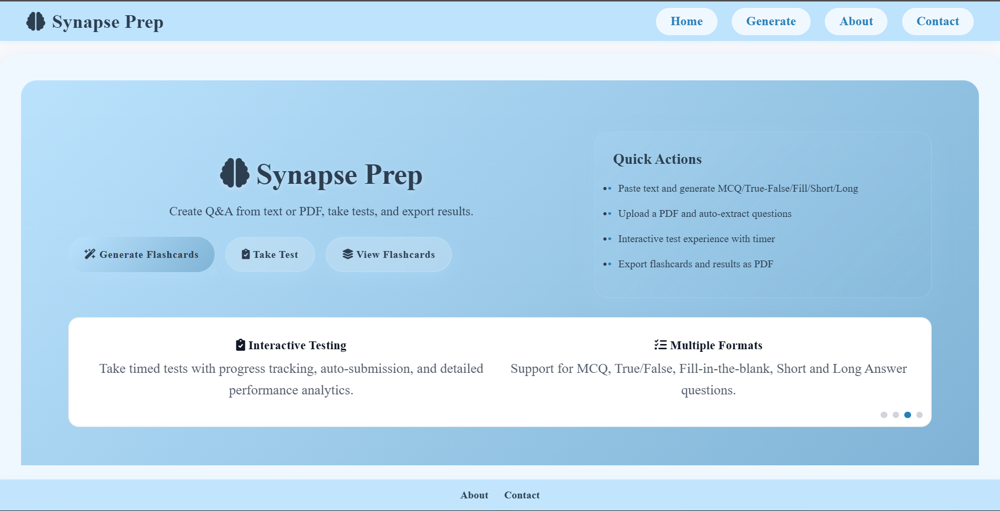
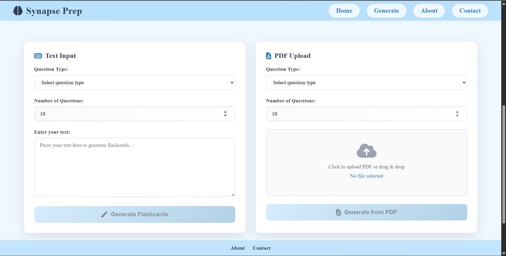
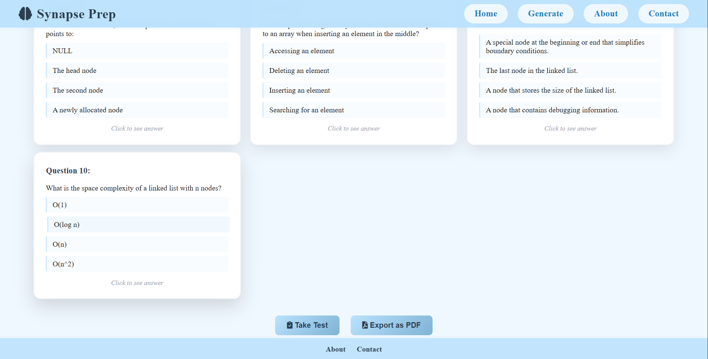
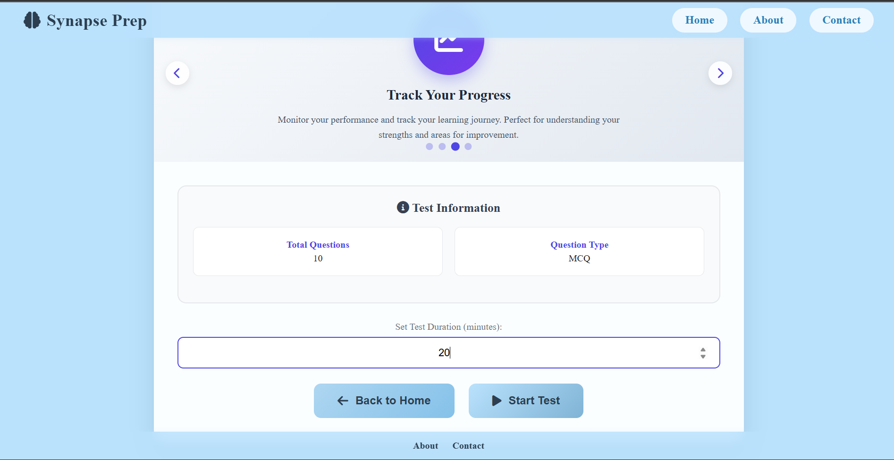
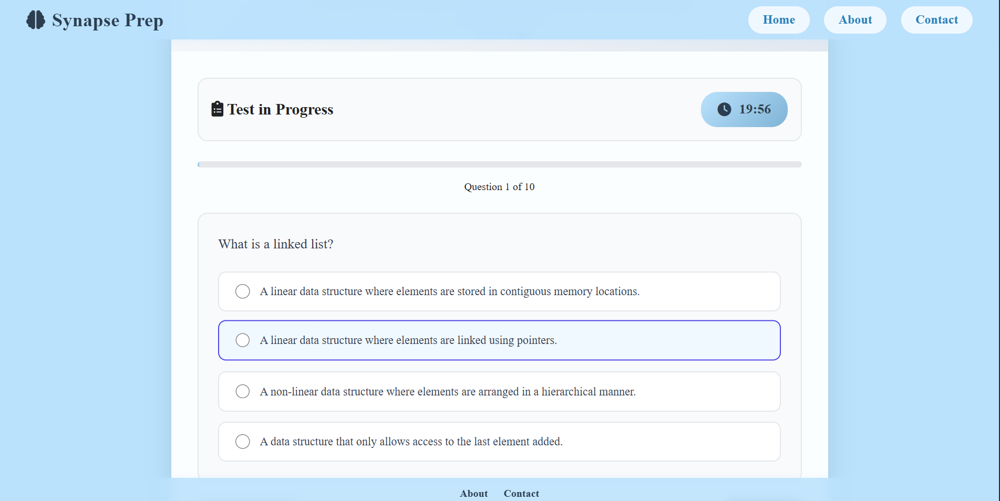
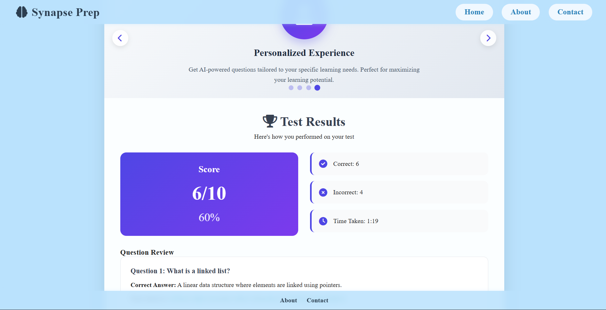

# 📘 An-AI-Powered-Flashcards-Quiz-Generator  

An AI-powered web application that helps learners generate flashcards and quizzes from **text or PDF inputs**. With support for multiple question types, interactive testing, and performance tracking, this tool enhances self-study and exam preparation.  

---

## 🚀 Features  

- **Generate Flashcards**  
  - Create Q&A pairs automatically using AI.  
  - Supports multiple question types:  
    - Multiple Choice Questions (MCQs)  
    - True/False  
    - Fill-in-the-blank  
    - Short Answer  
    - Long Answer  

- **Flashcard Management**  
  - View generated flashcards.  
  - Export flashcards as PDF for offline use.  

- **Quiz & Testing Mode**  
  - Take **timed quizzes** using generated questions.  
  - Interactive UI with progress tracking and auto-submission.  
  - Review results with correct/incorrect answers highlighted.  
  - Export results as PDF.  

- **Input Options**  
  - Generate flashcards from raw **text input**.  
  - Upload **PDFs** to auto-extract questions and answers.  

---

## 🖥️ Tech Stack  

- **Frontend**:  
  - HTML  
  - CSS  
  - JavaScript  

- **Backend**:  
  - Java **Spring Boot**  
  - **Gemini API** (for AI-powered question-answer generation)  

---

## 📷 Screenshots  

### 🔹 Home & Dashboard  
 

### 🔹 Generate from Text & PDF  
  

### 🔹 Flashcards View  
 

### 🔹 Test Setup  

### 🔹 Test in Progress  
  

### 🔹 Test Results  
  

---

## ⚡ How It Works  

1. Enter text or upload a PDF.  
2. Select question type and number of questions.  
3. Generate flashcards instantly.  
4. Take a timed quiz or export flashcards/results as PDF.  

---
 
